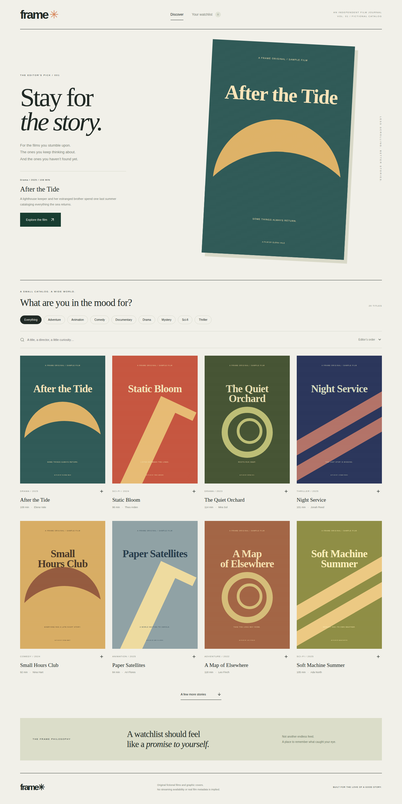

# Frame / Media Discovery & Watchlist

[](https://github.com/grantmaye/Media-Discovery-Watchlist-App/actions/workflows/ci.yml)

An independent film journal for discovering a small catalog, saving a watchlist, tracking progress, and recording what stayed with you. Built with Next.js, TypeScript, Apollo GraphQL, Node.js, and PostgreSQL.

The design uses oversized editorial type, original CSS graphic covers, warm paper, forest green, and an intentionally limited catalog. All 20 films, directors, descriptions, and release details are fictional demo content. These are not real streaming listings or licensed movie posters.



## Learn this repository

- [Technical manual](docs/technical-manual.md): architecture, contracts, setup, tests, failure labs, extension exercises with solutions, and interview preparation.
- [Product story](docs/product-story.md): intended users, a hypothetical benefit scenario, limitations, and a 60–90 second demo.

## Run

Node 22.13 or newer:

```sh
npm ci
npm run dev
```

Open http://localhost:3000. No movie API key or account is required. PGlite persists watchlists in `.data/frame`. Optional DATABASE_URL selects external PostgreSQL; APP_ORIGIN sets the exact public origin behind a proxy.

## Try the workflow

Search by title, director, or description. Filter by genre and sort by curated order, title, or year. Load another page. Save a film, open Your watchlist, change it to Watching or Finished, rate it, and add a personal note. Reload to verify persistence, then remove and re-add it.

Ratings belong to your finished films. They are not invented critic or community scores. The app does not play films or claim where they are streaming.

## Engineering choices

- GraphQL exposes a typed discovery connection and a nested watchlist. Resolvers delegate to service methods.
- Discovery uses a fixed, bounded in-memory catalog; watchlist records persist in PostgreSQL. Reading related title metadata does not issue one SQL query per film.
- Opaque cursors bind the last title ID to normalized search, genre, and sort. A cursor from different filters is rejected. The catalog is static, so the order remains stable between pages.
- One watchlist record per workspace and title prevents duplicate saves. An expected version rejects stale writes.
- Removing a title keeps a versioned tombstone. Deleting and recreating the row at version one could let an old version-one edit apply to a new record. Keeping the version avoids that reset.
- Ratings are integers from 1 to 5 and require Finished state. Changing to another state clears the rating; returning to Finished starts a new finished timestamp after leaving that state.
- Search is debounced and stale filter responses are ignored. Saving refetches the first discovery page to refresh watchlist state.

## Verify

```sh
npm run check
npm run build
npx playwright install chromium
npm run test:e2e
```

CI runs service checks on PGlite and PostgreSQL and a desktop/mobile discovery-to-watchlist walkthrough. Tests cover pagination uniqueness, cursor/filter mismatches, search, ratings, competing saves, isolation, viewer rejection, removal versions, persistence, and removal through the UI.

## Code map

| File                         | Responsibility                                    |
| ---------------------------- | ------------------------------------------------- |
| src/lib/catalog.ts           | Original fictional catalog                        |
| src/lib/service.ts           | Discovery, cursor validation, watchlist mutations |
| src/lib/graphql.ts           | Typed API and errors                              |
| src/components/discovery.tsx | Editorial discovery and watchlist interface       |
| src/app/globals.css          | Layout and original graphic cover system          |

[Engineering notes and interview questions](docs/engineering.md)

## Deliberate boundaries

The random cookie separates demo workspaces; it is not verified identity. The API includes a simulated viewer guard. There are no external movie APIs, subscriptions, collaborative lists, recommendations based on user behavior, streaming integrations, or third-party analytics.

Production improvements include real authentication, licensed metadata with required attribution, server-side provider credentials, persisted catalog search, operation cost limits, rate limits, workspace retention, migrations, and accessible account sharing. The initial schema initializer uses CREATE IF NOT EXISTS, not versioned migrations. A Node host is required; GitHub Pages cannot execute this backend.

MIT licensed.
